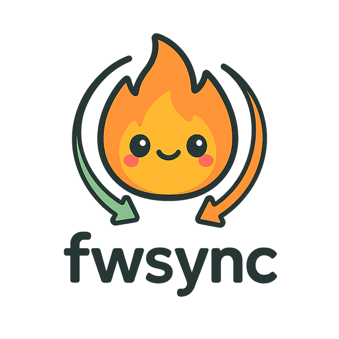

# fwsync



[](https://github.com/jharshman/fwsync/actions/workflows/ci.yaml)
[](https://goreportcard.com/report/github.com/jharshman/fwsync)

Provides CLI interface to update your personal Firewall Rules
associated with your Google Cloud Development VM.

## Installation

Install by running the following in your terminal:
```bash
$ curl https://raw.githubusercontent.com/jharshman/fwsync/master/install.sh | sh
```

## Usage

### Authentication
The reccomended method of authentication is to run the following command:

```bash
$ gcloud auth application-default login
```

### Init
After installing, you can invoke the CLI by typing `fwsync` in your terminal.
This by default will display some usage information.

To initialize fwsync type `fwsync init`. This will walk you through steps in
selecting the correct firewall to manage and will write out fwsync's config file
which will be located at `$HOME/.fwsync`.

### Update
If your IP updates and you notice  you've lost access to your CloudVM,
you can invoke `fwsync update` to automatically detect your new IP address
and update your Firewall Rule.
